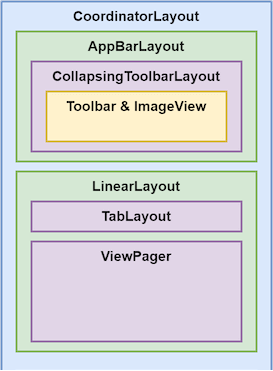
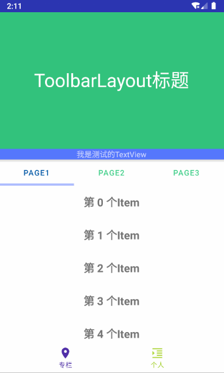
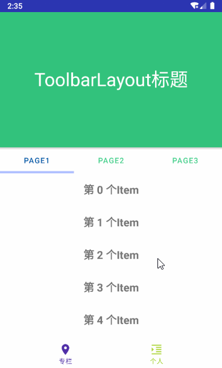
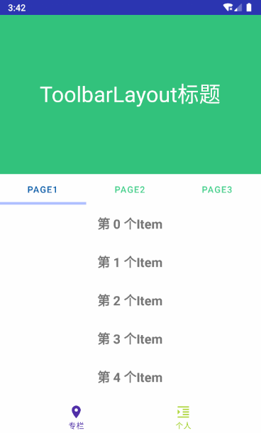
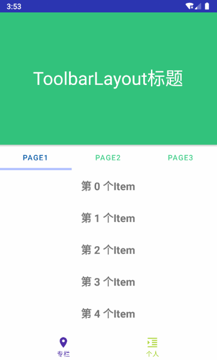
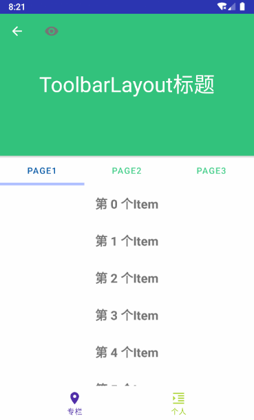
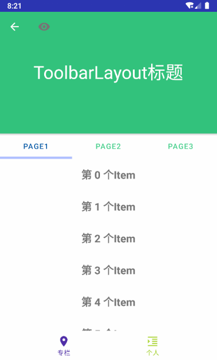

### 学习背景

以前的项目中是没有使用过这个布局的，后来在找工作面试中被问到了这个布局，而且发现新工作的APP首页也有使用到这个布局实现顶部功能折叠和展开的动画效果功能。当列表下拉滑动到顶部的时候，再下拉则会显示详细的天气信息；列表向上滚动则会收起天气详情，显示简单的天气图标。

### 学习目标

学习布局的使用方法，掌握并了解相关搭配使用的视图，上手几种常见实现效果。

### 简单介绍

父类是`FrameLayout`，作为协调者，根据子视图设置的`Behavior`来控制它们的行为。使用它的时候，一般子视图的组成是`AppbarLayout`+`RecyclerView`实现列表和表头的联动。

### Behavior

Behavior 是CoordinatorLayout的灵魂所在，它指定了CoordinatorLayout的**直接**子视图的行为方式，即在触摸和滑动时视图的行为方式。那么怎么把整个行为赋予给子视图呢？一般来说有2种推荐的方式：

- 通过代码绑定，获取到子视图的LayoutParam，强转为CoordinatorLayout的LayoutParam，再调用setBehavior方法设置行为就好了
- 通过 XML 绑定，在布局文件中给视图添加属性。app:layout_behavior="@string/appbar_scrolling_view_behavior" 就是指定了Behavior为`AppBarLayout.ScrollingViewBehavior`定义的行为。

在上述2种方法方法种，比较推荐第二种xml的方式，简单明了。

### 案例

找了一些文章，正好找到了跟现有APP首页很接近的一个布局，下面是层级图和xml布局



xml代码：

``` xml
<?xml version="1.0" encoding="utf-8"?>
<androidx.coordinatorlayout.widget.CoordinatorLayout xmlns:android="http://schemas.android.com/apk/res/android"
    xmlns:app="http://schemas.android.com/apk/res-auto"
    android:layout_width="match_parent"
    android:layout_height="match_parent">

    <com.google.android.material.appbar.AppBarLayout
        android:id="@+id/weather_title_bar_layout"
        android:layout_width="match_parent"
        android:layout_height="wrap_content"
        android:theme="@style/ThemeOverlay.AppCompat.Dark.ActionBar">

        <com.google.android.material.appbar.CollapsingToolbarLayout
            android:id="@+id/weather_title_collapsing"
            android:layout_width="match_parent"
            android:layout_height="wrap_content"
            app:contentScrim="@color/color_005eaa"
            app:expandedTitleGravity="center"
            app:layout_scrollFlags="scroll|exitUntilCollapsed|snap"
            app:statusBarScrim="@android:color/holo_red_dark"
            app:titleEnabled="true">

            <ImageView
                android:id="@+id/weather_icon"
                android:layout_width="match_parent"
                android:layout_height="250dp"
                android:background="@color/color_31c27c" />

            <androidx.appcompat.widget.Toolbar
                android:id="@+id/weather_toolbar"
                android:layout_width="match_parent"
                android:layout_height="?attr/actionBarSize"
                app:layout_collapseMode="parallax"
                app:layout_collapseParallaxMultiplier="0.1"
                app:popupTheme="@style/AppTheme.AppBarOverlay" />
        </com.google.android.material.appbar.CollapsingToolbarLayout>
    </com.google.android.material.appbar.AppBarLayout>

    <LinearLayout
        android:layout_width="match_parent"
        android:layout_height="match_parent"
        android:orientation="vertical"
        app:layout_behavior="@string/appbar_scrolling_view_behavior">

        <com.google.android.material.tabs.TabLayout
            android:id="@+id/room_pager_tab"
            android:layout_width="match_parent"
            android:layout_height="wrap_content"
            app:tabIndicatorColor="@color/colorAccent"
            app:tabIndicatorHeight="4dp"
            app:tabSelectedTextColor="@color/color_005eaa"
            app:tabTextColor="@color/color_43d28d" />

        <androidx.viewpager.widget.ViewPager
            android:id="@+id/room_pager"
            android:layout_width="match_parent"
            android:layout_height="match_parent" />
    </LinearLayout>
</androidx.coordinatorlayout.widget.CoordinatorLayout>
```
上面就是经典的上下解构，上部分为`AppBarLayout`下部分为`ViewPager`内容视图（房间设备列表），下面开始了解各个视图的特性。
### AppBarLayout
在CoordinatorLayout中，常见变化较多的就是AppBarLayout部分，实际下面的主体内容变化相对较少。那这些变化是如何产生的呢？实际上跟`app:layout_scrollFlags`这个属性标签有关，这个标签是设置给AppBarLayout的子视图的，它支持7种传值：noScroll(0x0)、scroll(0x1)、enterAlwaysCollapsed(0x2)、enterAlways(0x4)、exitUntilCollapsed(0x8)、snap(0x10) 和 snapMargins(0x20)

#### layout_scrollFlags  

- noScroll(0x0)  
表示这个视图是固定在顶部，不可滚动的，不能与其他6个标志搭配使用
- scroll(0x1)  
视图可以滚动，注意这个表示可以滚动，但是不决定滚动的过程、效果、结果，还需要跟其他标志搭配才能有具体的效果  

基于案例的xml布局，我们在`AppBarLayout`的子层级下添加一个TextView，但是不设置`app:layout_scrollFlags`这个标志，用来体现设置`noScroll`和`scroll`的差别  
  
从上图中可以看到设置了`scroll`的`CollapsingToolbarLayout`部分可以滚动，但是没有设置的`TextView`会有吸顶的效果，停留在顶端。

- enterAlways(0x4)  
其实这里的时候我有一些疑惑，明明这个标志位的效果要好理解一些，但是偏偏放在后面一位，所以这里先说这个标志位的效果  
  
向上滚动会使头部视图完全收起；向下滚动，即使列表没有滚到第1条，头部视图也会出现

- enterAlwaysCollapsed(0x2)  
  
向上滚动会使头部视图完全收起；向下滚动，没有滚动到第1条时出现折叠的头部视图`Toolbar`，滚动到第1条后，再下拉会让头部视图展开。  
折叠效果的出现，是因为`Toolbar`作为`CollapsingToolbarLayout`子视图设置了`layout_collapseMode`标签。  
那么问题来了，折叠之后的`CollapsingToolbarLayout`高度是多少呢？  
这里其实是区分情况的：  
1、如果`CollapsingToolbarLayout`子视图包含`Toolbar`，那么高度是`Toolbar`的高度  
2、如果不包含，那么为`CollapsingToolbarLayout`的`minHeight`标签指定的高度

- exitUntilCollapsed(0x8)  
  
向上滚动会使头部视图折叠；向下滚动到第1条后，再下拉会让头部视图展开。  

- snap(0x10)  
  
折叠时，如果还剩少于1/4的高度时，松手会自动收起；展开时，如果还剩大于3/4的高度时，松手会自动展开。

- snapMargins(0x20)  
与`snap`搭配使用，展开和收起后都会停在视图设置的marginTop 或 marginBottom 的位置。  

### CollapsingToolbarLayout 
app:contentScrim 设置折叠时**工具栏**布局的颜色（默认为 colorPrimary）  
app:statusBarScrim 设置折叠时**状态栏**的颜色（默认为colorPrimaryDark）  
app:expandedTitleGravity、app:expandedTitleMargin 等属性设置扩展标题（就是那个 ToolbarLayout 标题）的位置  
除了自身属性外，还有对子视图设置折叠模式的属性，下面细说
#### layout_collapseMode  
- off：默认属性，布局将正常显示，无折叠行为。
- pin：CollapsingToolbarLayout 折叠后，此布局将固定在顶部。
- parallax：CollapsingToolbarLayout 折叠时，此布局也会有视差折叠效果。如果设置了此值，还可以使用app:layout_collapseParallaxMultiplier 设置视差滚动因子，值为 0~1。  

下面通过2张图来对比`parallax`和`pin`的效果，对比之前先调用`Toolbar`的`setDisplayHomeAsUpEnabled`和`setLogo`方法设置导航返回和logo。  
*pin*   
  
*parallax*  
  

对比2张效果可以看出来设置`pin`之后导航控件会停留在顶部，直到折叠到最小才会跟随头部视图一起向上滚动到消失。
#### layout_collapseParallaxMultiplier  
当我们选择`parallax`视差模式的时候，还可以设置视差因子。如果给案例中的`ImageView`设置  

``` xml
app:layout_collapseMode="parallax"
app: layout_collapseParallaxMultiplier="1.0"
```
当视差因子为0时，`ImageView`在头部视图折叠时不会有向上滚动，视觉上有下部视图覆盖图片的感觉
当视差因子为1时，`ImageView`在头部视图折叠时会同步距离向上滚动，视觉上有下部视图将图片向上顶的感觉
当视差因子为0.5时，`ImageView`在头部视图折叠时会向上滚动，但是滚动的距离是下部视图移动距离的一半
这里我们就可以得出规律，视差因子决定了头部折叠时，被标记的视图滚动距离与折叠高度的关系：`视差因子 = 向上滚动距离 / ImageView高度`
